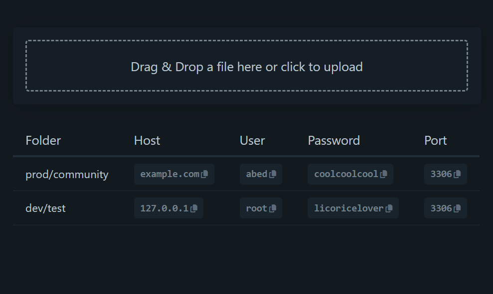

# Read HeidiSQL Export

## Discaimer: DON'T TRUST ANYONE!

This is a simple tool that allows you to read the export of HeidiSQL settings. It is not intended to be used in a production environment. It is only for educational purposes. Or if you want to check your own settings.

Please do not use this with bad intentions.  
Your pillow will always be hot if you do.




## How to use

### 1. export the txt-file
In HeidiSQL go to "File > Export settings as File..."

### 2. clone this repository
Clone this repository to your local machine.

### 3. start a local server
Start a local server in the root of this project.

For example with PHP:
```
php -S localhost:80
```
or with Python:
```
python -m SimpleHTTPServer 80
```
or with Node.js:
```
http-server -p 80
```

### 4. open the page
Now open your browser and navigate to [localhost:80]() or whatever your terminal says.

### 5. drag and drop the txt-file into the dropzone
Now drag and drop the txt-file into the dropzone on the page.  
You should now see your settings.